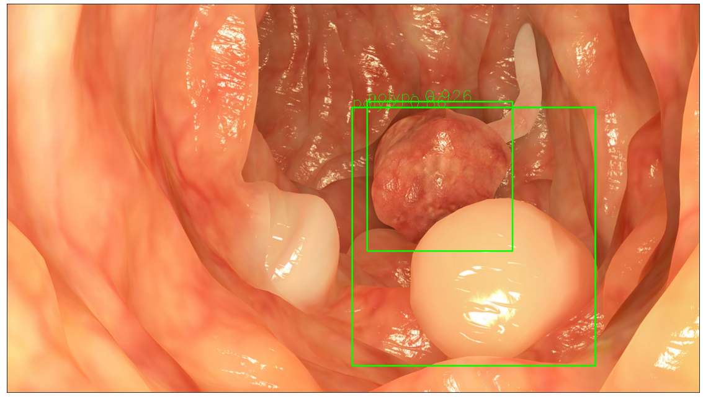
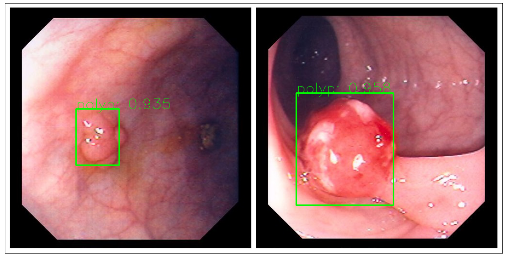

# Simple polys detection project
This project was meant for education purpose. It base on the "Faster RCNN" for object detection.
## Dependency
- [pytorch](https://pytorch.org/)
## Dataset
The dataset you can download from:
[Kvasir-SEG](https://datasets.simula.no/kvasir-seg/)

Some of the image result:

  <kbd>
    
  </kbd>
  <kbd>
    
  </kbd>

